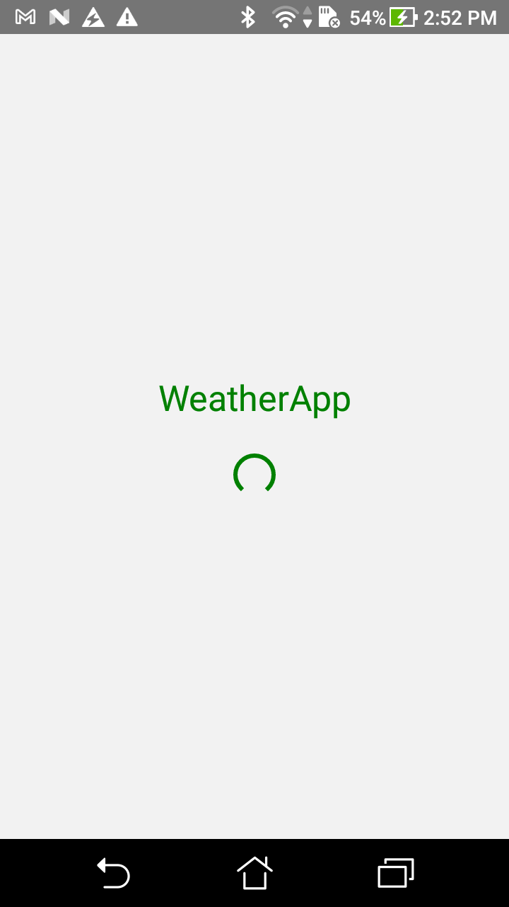
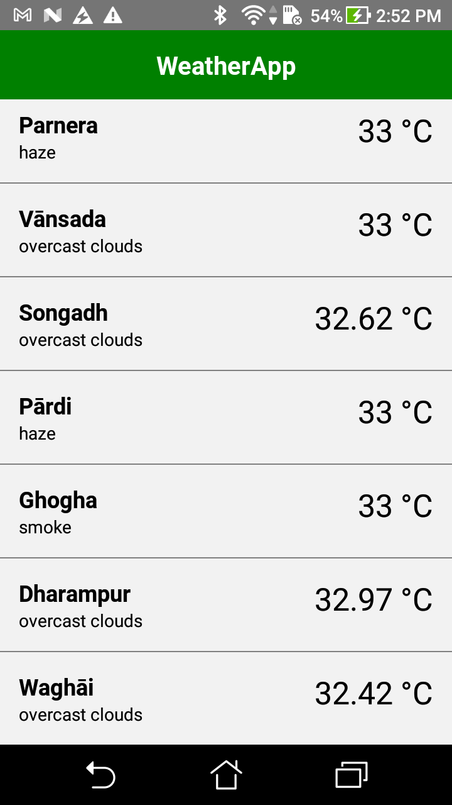
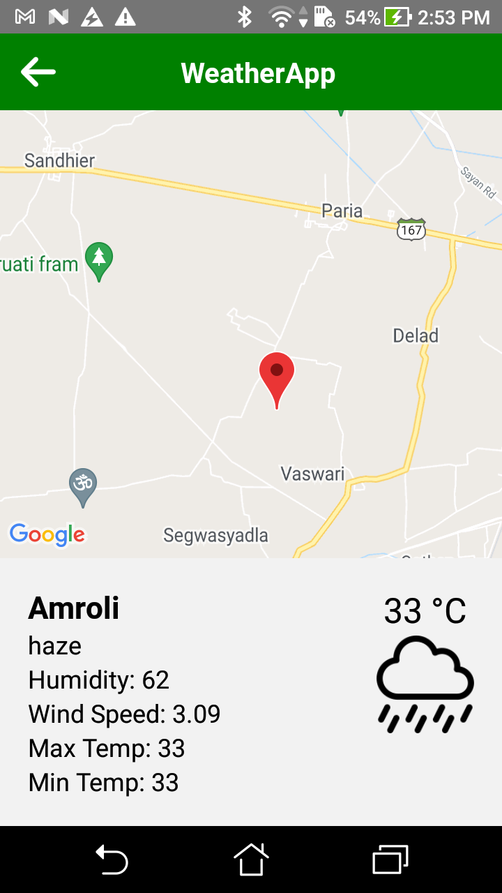
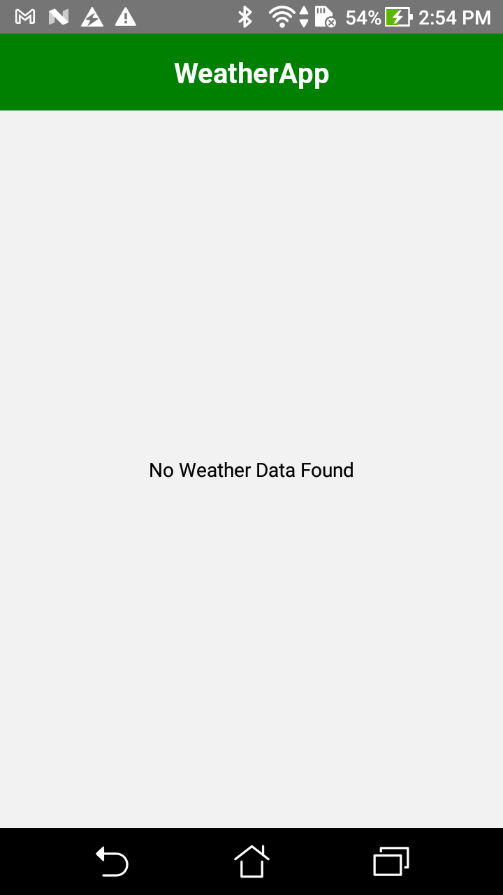
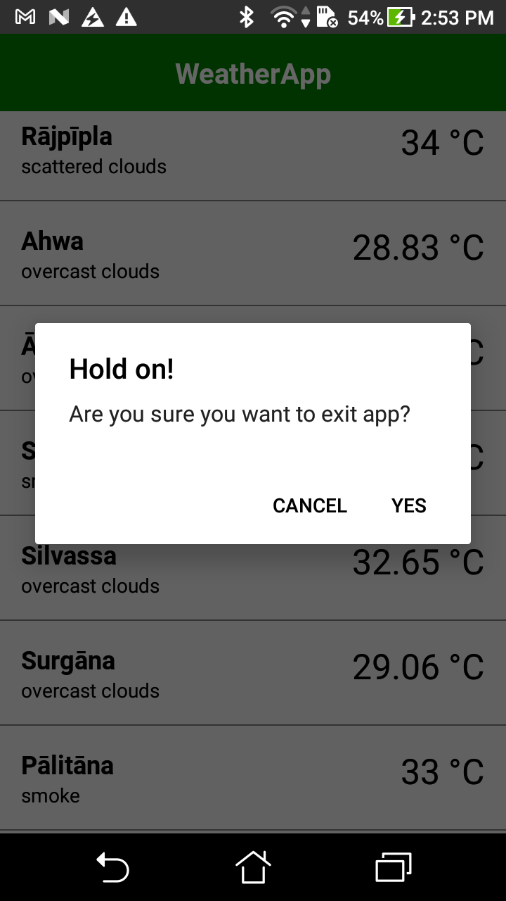

# Weather App

 In this tutorial, we'll make a small Weather app.
 <hr />
 <div align="center">
    
    
    
</div>
<div align="center">
     
                                                                                        
</div>
    
https://user-images.githubusercontent.com/30593625/212825792-657e46bb-5ed4-453a-bdcd-4ed46e71a833.mp4

<h3>Installation and Usage</h3>
<hr />

**Step 1:**

Download or clone this repo by using the below link:

```
git clone https://github.com/SagarMandani/weather-app.git
```

**Step 2:**

Go to project root folder

```
cd weather-app
```

**Step 3:**

Execute the following command in console to get the required dependencies:

```
npm or yarn install
```

**Step 4:**

Make sure you have an ios Simulator or Android Emulator running or have an ios device with you:

```
npm or yarn start
```

* Android

yarn android to run the Android application (remember to start a simulator or connect an Android phone)

```
npx react-native run-android
```

* IOS

```
cd ios -> pod install to install pod dependencies -> cd ..
```

yarn ios to run the iOS application (remember to start a simulator or connect an iPhone phone)

```
npx react-native run-ios
```
